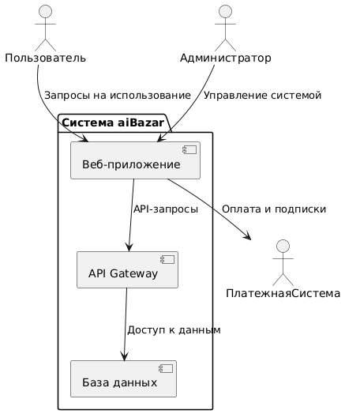
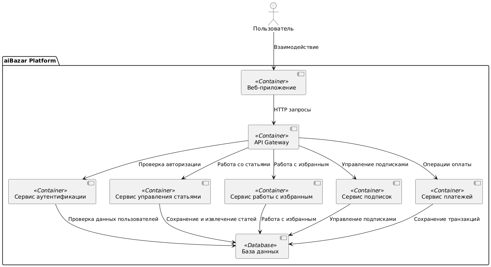
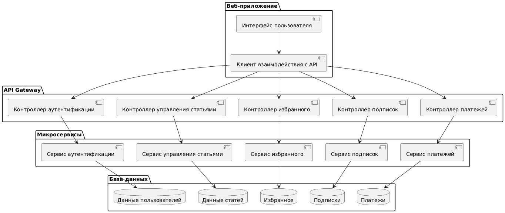
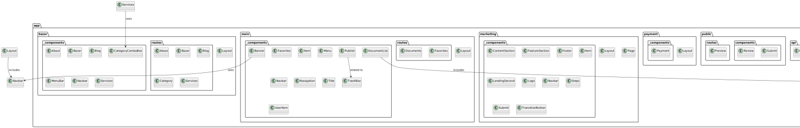

# Лабораторная работа №2

## Тема: Использование нотации C4 model для проектирования архитектуры программной системы

## Цель работы:
Получить опыт использования графической нотации для фиксации архитектурных решений.

---

## Диаграмма системного контекста

### Описание:
Диаграмма системного контекста иллюстрирует основные элементы системы и их взаимодействие с внешними актёрами. Она помогает понять общую картину системы, включая пользователей, внешние сервисы и ключевые функции системы.

**Диаграмма системного контекста:**

---

## Диаграмма контейнеров

### Описание:
Диаграмма контейнеров детализирует архитектуру системы, разбивая её на контейнеры, которые представляют собой основные части системы, такие как веб-приложение, база данных, API Gateway и т.д. Каждый контейнер обозначает логический блок системы, который может быть развернут независимо.

**Причины выбора базового архитектурного стиля:**
1. **Микросервисная архитектура** была выбрана для повышения модульности системы и упрощения масштабирования отдельных её частей.
2. **Сетевое взаимодействие между модулями** обеспечивает независимость компонентов и возможность их развертывания в разных средах.
3. Использование **REST API** для взаимодействия между контейнерами повышает совместимость и стандартизацию.

**Диаграмма контейнеров:**

---

## Диаграмма компонентов

### Описание:
Диаграмма компонентов детализирует внутреннюю структуру одного из контейнеров. Например, это может быть контейнер веб-приложения, который включает в себя компоненты аутентификации, работы с избранным, публикации статей и управления платежами.

**Место для диаграммы:**

### Дополнительная диаграмма компонентов
Для остальных контейнеров также может быть представлена дополнительная диаграмма компонентов. Например, для API Gateway или базы данных.

**Место для диаграммы:**

---

