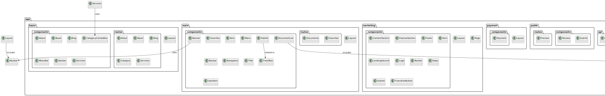
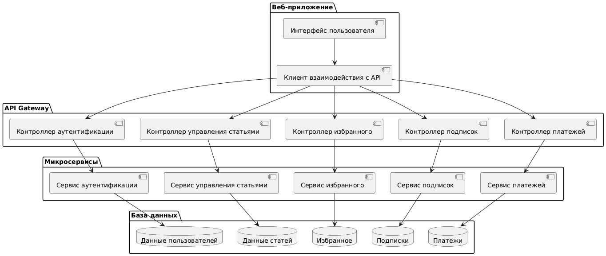
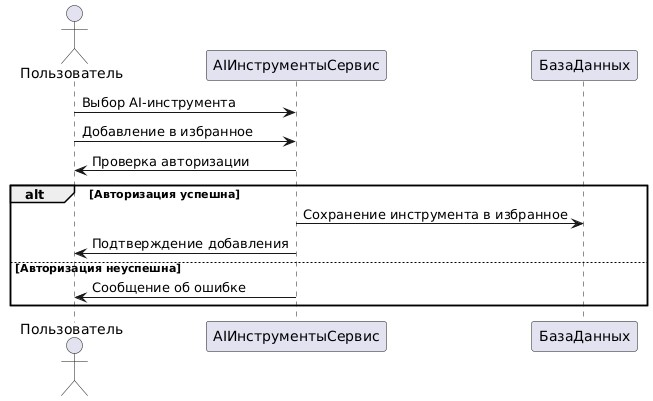
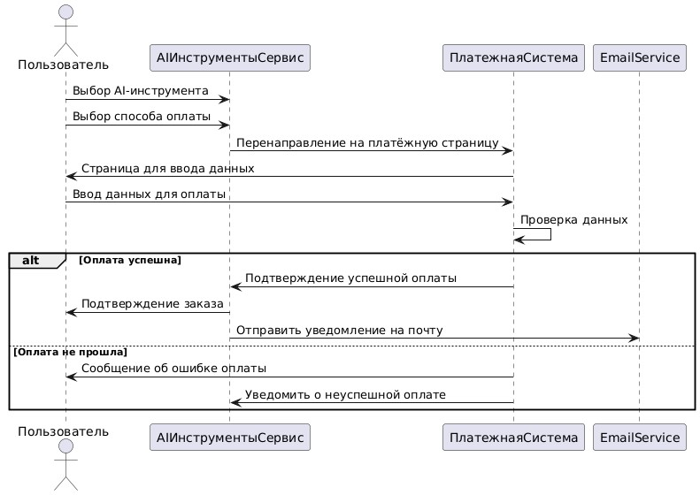
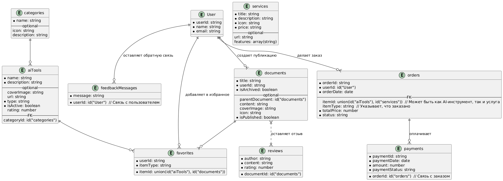

# Лабораторная работа №3

## Описание

Проект включает использование принципов проектирования на уровне методов и классов. Включены диаграммы и программный код для реализации функциональности системы aiBazar.

## Диаграммы

### 1. Диаграмма контейнеров

Диаграмма контейнеров иллюстрирует основные элементы системы и их взаимодействие на высоком уровне. Включены пользовательский интерфейс, API, микросервисы и базы данных, что позволяет понять архитектуру системы.


### 2. Диаграмма компонентов

Диаграмма компонентов детализирует отдельные части системы, такие как модули аутентификации, работы с избранным, публикации статей и платежей. Каждый компонент выполняет строго определённые функции.




### 3. Диаграмма последовательностей

Диаграмма последовательностей демонстрирует взаимодействие между различными частями системы для выполнения ключевых операций. Например, добавление инструмента в избранное, оплата ИИ или авторизация пользователя.

Пример последовательности для варианта "Добавление инструмента в избранное":


Пример последовательности для варианта "оплата ии":


Пример последовательности для варианта "авторизация":


### 4. Модель БД

Модель базы данных визуализирует структуру хранения данных системы. Она включает такие сущности, как пользователи, инструменты ИИ, избранное, заказы и платежи. Диаграмма показывает связи между ними, что помогает понять, как информация организована и взаимодействует.



---

# Реализация клиентского и серверного кода с учетом принципов KISS, YAGNI, DRY и SOLID

## Клиентский код (Python)

```python
# client.py
import requests

API_URL = 'http://localhost:5000/api'

def add_to_favorites(user_id, tool_id):
    payload = {'user_id': user_id, 'tool_id': tool_id}
    response = requests.post(f"{API_URL}/favorites", json=payload)
    if response.status_code == 201:
        print("Инструмент успешно добавлен в избранное.")
    else:
        print("Ошибка при добавлении в избранное.")

def main():
    user_id = 1
    tool_id = 101
    add_to_favorites(user_id, tool_id)

if __name__ == "__main__":
    main()
```

Серверный код (Python с использованием Flask)
```python
# server.py
from flask import Flask, request, jsonify
from flask_sqlalchemy import SQLAlchemy

app = Flask(__name__)
app.config['SQLALCHEMY_DATABASE_URI'] = 'sqlite:///aibazar.db'
db = SQLAlchemy(app)

class Favorite(db.Model):
    id = db.Column(db.Integer, primary_key=True)
    user_id = db.Column(db.Integer, nullable=False)
    tool_id = db.Column(db.Integer, nullable=False)

@app.route('/api/favorites', methods=['POST'])
def add_favorite():
    data = request.get_json()
    user_id = data.get('user_id')
    tool_id = data.get('tool_id')
    
    if not user_id or not tool_id:
        return jsonify({'error': 'Недостаточно данных'}), 400
    
    favorite = Favorite(user_id=user_id, tool_id=tool_id)
    db.session.add(favorite)
    db.session.commit()
    return jsonify({'message': 'Добавлено в избранное'}), 201

if __name__ == "__main__":
    db.create_all()
    app.run(debug=True)

```

# Применение принципов KISS, YAGNI, DRY и SOLID

## KISS (Keep It Simple, Stupid)

Клиентский и серверный код написаны максимально просто и понятно, без избыточной сложности. Используются минимальные необходимые библиотеки (`requests` и `Flask`), что облегчает понимание и поддержку кода.

## YAGNI (You Aren't Gonna Need It)

Реализованы только необходимые функции для добавления инструмента в избранное. Не добавлены дополнительные функции или возможности, которые могут понадобиться в будущем, но в данный момент не требуются.

## DRY (Don't Repeat Yourself)

Логика обработки запроса на сервере централизована в одном месте (`add_favorite`), что предотвращает дублирование кода. Клиент использует общую функцию `add_to_favorites` для выполнения операций, избегая повторения кода.

## SOLID

- **S (Single Responsibility Principle):** Каждый модуль выполняет одну задачу. Клиент отвечает за отправку запросов, сервер — за обработку и хранение данных.
  
- **O (Open/Closed Principle):** Серверный код открыт для расширения (например, добавление новых маршрутов), но закрыт для модификации существующих функций.
  
- **L (Liskov Substitution Principle):** В данном простом примере не требуется, но структура кода позволяет легко заменять компоненты без нарушения функциональности.
  
- **I (Interface Segregation Principle):** Клиент и сервер взаимодействуют через четко определенные API, обеспечивая разделение интерфейсов.
  
- **D (Dependency Inversion Principle):** Высокоуровневые модули (например, обработчики маршрутов) не зависят от низкоуровневых (например, конкретные базы данных), а используют абстракции (`SQLAlchemy`).

# Применимость дополнительных принципов разработки

## BDUF (Big Design Up Front)

**Отказ от применения:**

Проект следует принципу YAGNI, реализуя только необходимые функции без масштабного проектирования. Это позволяет быстрее реагировать на изменения требований и избегать излишней сложности.

## SoC (Separation of Concerns)

**Применение:**

Код разделен на клиентскую и серверную части, каждая из которых отвечает за свои задачи. Сервер управляет данными и бизнес-логикой, а клиент — взаимодействием с пользователем. Это упрощает поддержку и масштабирование системы.

## MVP (Minimum Viable Product)

**Применение:**

Проект реализует минимально жизнеспособный продукт, предоставляя основные функции, такие как добавление инструментов в избранное. Это позволяет быстро запустить систему и получать обратную связь для дальнейшего развития.

## PoC (Proof of Concept)

**Отказ от применения:**

В данном проекте не требуется доказательство концепции, так как основные функции уже реализованы и работают. Основная цель — создание рабочей системы, а не подтверждение возможности реализации.

# Заключение

В ходе реализации клиентского и серверного кода для системы aiBazar были учтены основные принципы разработки, что позволило создать простой, понятный и поддерживаемый код. Дополнительные принципы разработки были рассмотрены и частично применены в зависимости от требований проекта, что обеспечило эффективную разработку и последующую поддержку системы.
