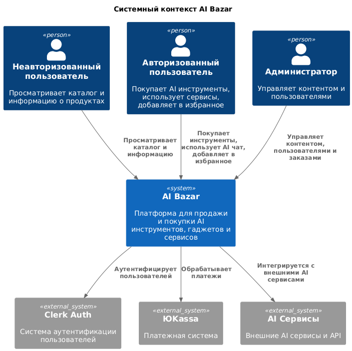
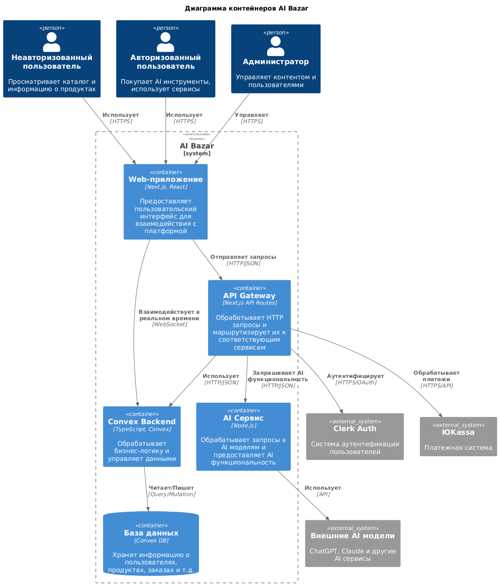
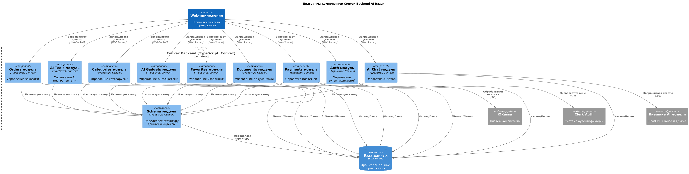

# Лабораторная работа №2

## Тема: Использование нотации C4 model для проектирования архитектуры программной системы

## Цель работы:
Получить опыт использования графической нотации для фиксации архитектурных решений.

---

## Диаграмма системного контекста

### Описание:
Диаграмма системного контекста иллюстрирует основные элементы системы и их взаимодействие с внешними актёрами. Она помогает понять общую картину системы, включая пользователей, внешние сервисы и ключевые функции системы.

**Описание основных элементов диаграммы:**

**Пользователи (Persons):**
- **Неавторизованный пользователь** - посетитель, который может просматривать каталог и информацию о продуктах без регистрации
- **Авторизованный пользователь** - зарегистрированный пользователь, который может совершать покупки, использовать сервисы и добавлять товары в избранное
- **Администратор** - управляет контентом, пользователями и заказами на платформе

**Системы:**
- **AI Bazar** - центральная система, платформа для продажи и покупки AI инструментов
- **Clerk Auth** - внешняя система аутентификации
- **ЮKassa** - внешняя платежная система
- **AI Сервисы** - внешние AI сервисы и API, с которыми интегрируется платформа

**Взаимодействия:**
- Неавторизованные пользователи могут только просматривать каталог и информацию
- Авторизованные пользователи могут совершать покупки, использовать AI чат и добавлять товары в избранное
- Администраторы управляют всем контентом и пользователями
- AI Bazar взаимодействует с внешними системами для аутентификации, обработки платежей и интеграции с AI сервисами

**Диаграмма системного контекста:**

---

## Диаграмма контейнеров

### Описание:
Диаграмма контейнеров детализирует архитектуру системы, разбивая её на контейнеры, которые представляют собой основные части системы, такие как веб-приложение, база данных, API Gateway и т.д. Каждый контейнер обозначает логический блок системы, который может быть развернут независимо.

**Выбранный архитектурный стиль: Микросервисная архитектура с элементами событийно-ориентированной архитектуры**

Для AI Bazar выбрана микросервисная архитектура с элементами событийно-ориентированной архитектуры, что позволяет:

1. **Модульность и масштабируемость:** Каждый контейнер отвечает за определенную функциональность и может масштабироваться независимо.
2. **Гибкость в технологиях:** Разные компоненты могут использовать разные технологии (Next.js для фронтенда, Convex для бэкенда, специализированные сервисы для AI).
3. **Отказоустойчивость:** Проблемы в одном сервисе не приводят к отказу всей системы.
4. **Реальное время:** Convex обеспечивает событийно-ориентированное взаимодействие в реальном времени.

**Сетевое взаимодействие:**
- **Клиент-сервер:** HTTPS между пользователями и Web-приложением
- **API взаимодействие:** HTTP/JSON между компонентами
- **Реальное время:** WebSocket между Web-приложением и Convex Backend
- **Внешние интеграции:** HTTPS/API с внешними системами

**Модули развертывания:**
- **Frontend:** Web-приложение (может быть развернуто на Vercel)
- **Backend API:** API Gateway (может быть развернуто вместе с Frontend на Vercel)
- **Convex Backend:** Отдельный сервис, развернутый в облаке Convex
- **AI Сервис:** Отдельный сервис, который может быть развернут на облачной платформе (AWS, GCP, Azure)

**Диаграмма контейнеров:**

---

## Диаграмма компонентов для Web-приложения

### Описание основных элементов диаграммы:

**Маркетинговый модуль:**
- Реализует публичные страницы сайта (главная, о нас, блог)
- Отвечает за привлечение пользователей
- Представлен файлами в директории app/(marketing)/
- Ключевые файлы: navbar.tsx, landingsecond.tsx

**Bazar модуль:**
- Основной модуль для просмотра и покупки AI инструментов
- Содержит каталог, фильтрацию и детальные страницы продуктов
- Представлен файлами в директории app/(bazar)/
- Ключевые файлы: menubar.tsx

**Документы модуль:**
- Управление документами и контентом
- Позволяет создавать, редактировать и публиковать документы
- Представлен файлами в директории app/(main)/

**Платежный модуль:**
- Обработка платежей и заказов
- Интеграция с ЮKassa
- Представлен файлами в директории app/(payment)/

**Гаджеты модуль:**
- Каталог AI гаджетов
- Фильтрация по категориям
- Представлен файлом app/(bazar)/(routes)/gadgets/page.tsx

**Чат модуль:**
- Интерфейс для AI чата
- Взаимодействие с AI моделями
- Представлен файлами в директории app/(bazar)/(routes)/aibazargpt/chat/

**Избранное модуль:**
- Управление избранными инструментами
- Сохранение и организация избранных элементов
- Представлен файлами в директории app/(main)/(routes)/favorites/

**Авторизация модуль:**
- Интеграция с Clerk Auth
- Управление аутентификацией и авторизацией
- Использует Clerk SDK

**UI компоненты:**
- Общие компоненты пользовательского интерфейса
- Кнопки, формы, модальные окна и т.д.
- Представлены файлами в директории components/ui/

**API клиент:**
- Клиент для взаимодействия с Convex Backend
- Использует Convex SDK для запросов и мутаций
- Обеспечивает реальное время через WebSocket

**Диаграмма компонентов для Web-приложения:**

---

## Диаграмма компонентов для Convex Backend

### Описание основных элементов диаграммы:

**Schema модуль (convex/schema.ts):**
- Определяет структуру данных и индексы для всех таблиц
- Является фундаментом для всех остальных модулей
- Содержит определения таблиц: documents, aiTools, aiGadgets, categories, favorites, orders, payments и т.д.
- Определяет связи между таблицами через индексы

**Documents модуль (convex/documents.ts):**
- Управление документами (создание, чтение, обновление, удаление)
- Реализует логику для работы с иерархической структурой документов
- Обеспечивает контроль доступа к документам

**AI Tools модуль (convex/aiTools.ts):**
- Управление AI инструментами
- Предоставляет API для получения списка инструментов, фильтрации по категориям
- Обрабатывает рейтинги и отзывы

**AI Gadgets модуль (convex/aiGadgets.ts):**
- Управление AI гаджетами
- Предоставляет API для получения списка гаджетов, фильтрации по категориям
- Обрабатывает статусы доступности

**Categories модуль:**
- Управление категориями для AI инструментов и гаджетов
- Предоставляет иерархическую структуру категорий

**Favorites модуль:**
- Управление избранными элементами пользователей
- Позволяет добавлять/удалять элементы из избранного
- Поддерживает разные типы элементов (инструменты, документы)

**Orders модуль (convex/orders.ts):**
- Управление заказами пользователей
- Обрабатывает создание, обновление и отслеживание заказов
- Интегрируется с платежным модулем

**Payments модуль (convex/payments.ts):**
- Обработка платежей
- Интеграция с ЮKassa
- Отслеживание статусов платежей

**Auth модуль:**
- Управление аутентификацией и авторизацией
- Интеграция с Clerk Auth
- Проверка токенов и прав доступа

**AI Chat модуль:**
- Обработка AI чатов
- Интеграция с внешними AI моделями
- Хранение истории чатов

**Особенности архитектуры Convex Backend:**
- **Реактивность:** Convex обеспечивает реактивные обновления данных в реальном времени
- **Функциональный подход:** Модули состоят из чистых функций (queries, mutations)
- **Декларативная схема:** Структура данных определяется декларативно в Schema модуле
- **Автоматическая синхронизация:** Convex автоматически синхронизирует данные между клиентом и сервером

**Диаграмма компонентов для Convex Backend:**

